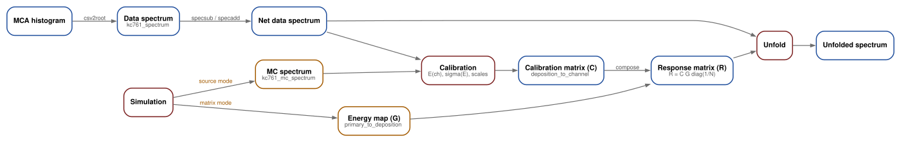
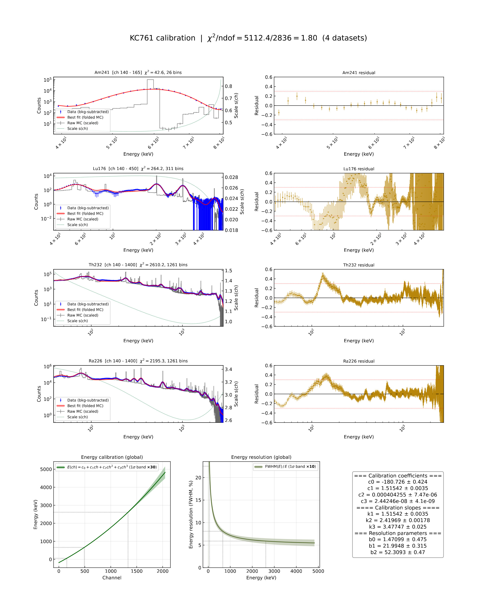
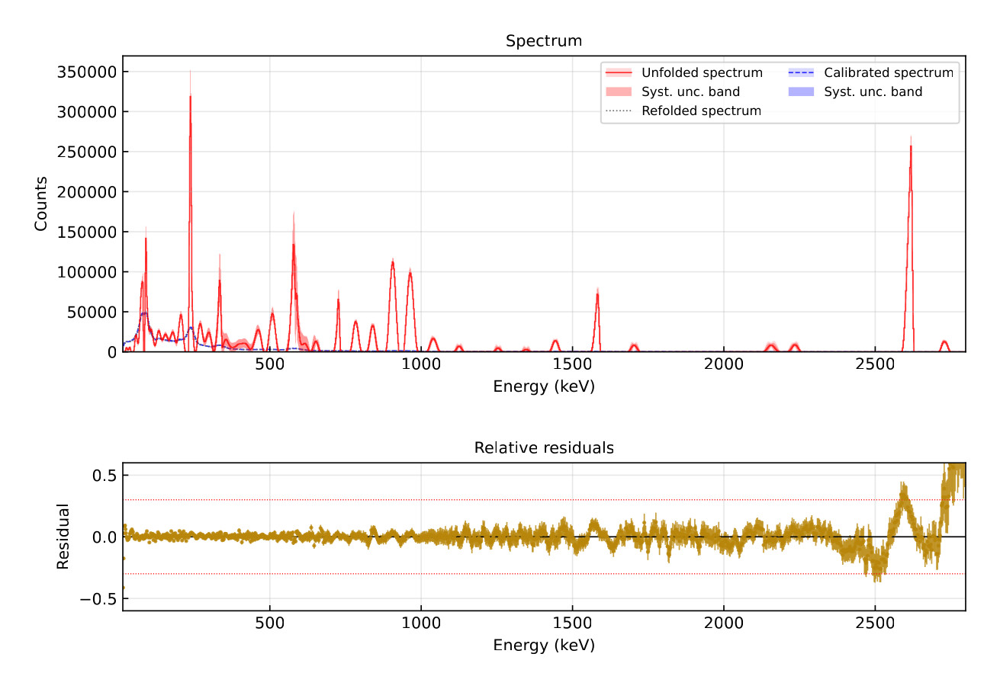
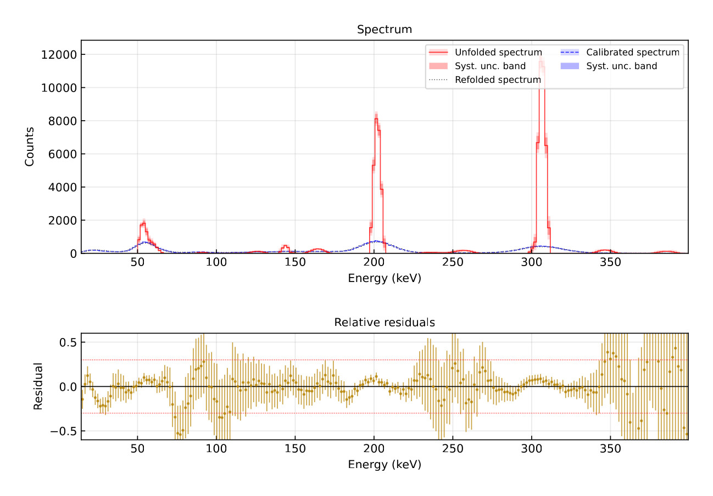
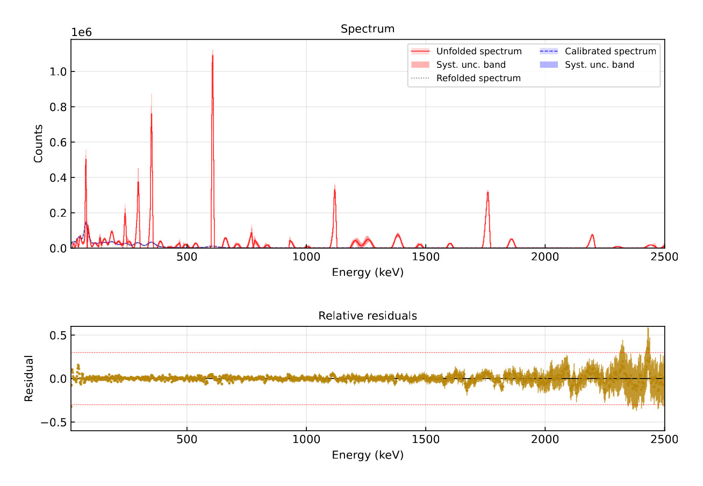

# KC761 工具包

**简体中文** | [English](README.en.md)

本工具包覆盖从 MEASALL KC761x/KC761 谱仪实测脉冲幅度直方图（pulse-height histogram）到初级伽马能谱（primary gamma spectrum）的完整链条。`calib` 以已知放射性核素的实测谱与模拟谱为输入，联合拟合能量刻度（energy calibration）与能量分辨率模型（resolution model）；`compose` 将该刻度与 Geant4 矩阵模拟给出的初级—沉积矩阵合成为初级—道址响应矩阵（response matrix）；`unfold` 求解由此得到的非负反问题，并给出统计与系统不确定度。全部实现均基于 Python 科学计算栈，ROOT 文件经 `uproot` 读写，因而无需安装 ROOT。每个环节对应一个子命令，写出一个带完整溯源信息（provenance）的数据产品（product），并由一个公式登记号（`F-...`）标识，其推导见 [docs/derivations.md](docs/derivations.md)。拟合与不确定度传递一律使用解析雅可比矩阵（Jacobian），生产流程中不引入有限差分。

各环节如下：

* `csv2root` 将 MCA 导出的原始 CSV 转换为谱数据产品；`specsub`（以及 `specadd`）用于谱的合成，本底按采集时间比 $r = t_A / t_B$ 缩放。
* `sim` 在源模式（source mode）下运行 Geant4，为每个刻度源生成一套蒙特卡罗谱（`mc_spectrum`）；在矩阵模式（matrix mode）下，依据刻度产品生成初级—沉积矩阵 $G$。
* `calib` 对全部实测谱与模拟谱数据对联合拟合能量刻度 $E(\mathrm{ch})$ 与分辨率模型 $\sigma(E)$，并报出参数协方差；`compose` 构造响应矩阵 $R = C\ G\ \mathrm{diag}(1/N)$ 以供检查。
* `unfold` 求解正则化问题 $\min_{\mu \ge 0} \lVert (R\mu - y)/\sigma \rVert^2 + \alpha \lVert \tilde{D}'\mu \rVert^2$，报出解谱能谱、重褶积谱（refolded spectrum）与两条不确定度带，并以相对残差作为拟合诊断量。



*各环节之间交换的数据产品与数据流；第 2 节给出问题陈述，[§1.1](#11-输出结果概览) 的图注给出相应的报告图。*

**快速跳转：** [快速开始](#1-快速开始) · [输出结果概览](#11-输出结果概览) · [探测器模型](#2-探测器模型能量刻度与能量分辨率) · [刻度](#5-刻度跨数据集联合拟合) · [解谱](#6-解谱一正则化非负问题) · [不确定度](#8-不确定度传递统计与系统分量的严格拆分) · [模拟](#9-模拟抽样精确方差与随机数种子) · [运行时校验](#11-运行时校验) · [运行方式](#12-运行方式) · [配置文件](#13-配置文件) · [开发检查](#16-开发检查) · [仓库结构](#17-仓库结构) · [文档](#18-文档)

---

## 1. 快速开始

全部操作均在仓库根目录下执行；`work/` 存放数据与数据产品，不纳入版本控制。

```bash
python -m venv .venv && . .venv/bin/activate    # Python >= 3.12
pip install -r requirements.txt                 # numpy、scipy、numba、uproot、sympy、matplotlib
                                                # 需重跑模拟环节时另装 geant4-pybind
python kc761tool.py --help                      # 七个子命令
```

生产链条按环节逐一列出（路径取自参考测量活动 `work/data/2609a/`，使用时替换为自己的测量活动）。每条命令都会打印解析后的输入，并以原子方式写出数据产品；四个接受 `-c/--config` 的命令（`sim`、`calib`、`compose`、`unfold`）支持 `--dry-run`，可在无副作用的前提下显示解析后的运行配置：

```bash
# 1. MCA 原始 CSV 导出 -> 谱数据产品（计数、fSumw2、DAQ 时间）
python kc761tool.py csv2root work/data/2609a/th232-260908.csv

# 2. 本底扣除，按采集时间比缩放
python kc761tool.py specsub work/data/2609a/th232-260908.root work/data/2609a/bkg-260909.root

# --- 用已知放射性核素的源对探测器做一次性刻度 ---
# 3. Geant4 源模式，每个刻度源各运行一次
python kc761tool.py sim --th232 -n 200000000 -s 908136382

# 4. 能量刻度与分辨率模型的联合拟合
python kc761tool.py calib -c work/calib-2609a.toml

# 5. Geant4 矩阵模式，在 calib 之后运行一次：初级—沉积矩阵 G
python kc761tool.py sim --plane-front-gamma work/calib/calib-2609a.root \
    -n 1000000000 -f

# 6. 合成 R = C G diag(1/N) 以供检查（unfold 内部会自行合成）
python kc761tool.py compose --calib work/calib/calib-2609a.root \
    --sim work/sim/calib-2609a-plane-front-gamma-n1000000000-s908136382.root

# --- 随后用该刻度解谱待研究的能谱 ---
# 7. 非负 Tikhonov 解谱，给出统计/系统不确定度带与诊断图
python kc761tool.py unfold \
    --data work/data/2609a/th232-260908-subbkg.root \
    --calib work/calib/calib-2609a.root \
    --sim   work/sim/calib-2609a-plane-front-gamma-n1000000000-s908136382.root \
    --energy-low 30 --energy-high 3000
```

第 3—6 步是一次性的准备工作：它们使用*已知*核素的测量结果，产生刻度与响应矩阵；第 7 步再把这两个数据产品应用于待研究的能谱。本示例解谱的是用于刻度的源之一；在实际分析中，`--data` 指向待分析能谱的数据产品。

在参考测量活动的数据产品上，解谱本身约需 11 s（首次使用时响应核的即时编译（JIT）主导了墙钟时间；该核为线程并行，结果与线程数无关）。`sim` 是唯一需要 Geant4 的环节；`calib`、`compose` 与 `unfold` 仅依赖已记录的数据产品即可运行。

`calib`、`compose`、`sim` 与 `unfold` 亦可接受 TOML 配置文件（`-c/--config examples/<command>.toml`）；所有写数据产品的命令在目标文件已存在时一律拒绝覆盖，除非显式给出 `-f/--force`。

### 1.1 输出结果概览

图件由两个执行拟合的命令产生，顺序与工作流一致。`calib` 在**刻度源上一次性运行**：已知放射性核素的实测谱与其 Geant4 模拟谱配对，确定能量刻度、分辨率模型与探测器响应。`unfold` 随后把该刻度应用于待研究的能谱，后者通常不属于刻度测量。下文图件取自刻度源的测量结果。报告图较宽，故以固定宽度展示；查看面板标签请打开原始尺寸图。

<a href="examples/plots/calib-example.jpg"></a>

*`calib` 报告图：每个数据集一行数据/模拟对比（拟合窗口、$\chi^2$ 与道数、叠加在原始谱与拟合后数据上的拟合模型、残差、逐数据集的二次 Bezier 归一化因子），其后为全局能量刻度 $E(\mathrm{ch}) = c_0 + c_1\mathrm{ch} + c_2\mathrm{ch}^2 + c_3\mathrm{ch}^3$、全局分辨率 $\mathrm{FWHM}(E)$，以及拟合系数及其不确定度。*

以下三幅图给出 Th-232、Lu-176 与 Ra-226 的解谱结果（能谱面板为线性纵轴；`--log-plot` 可插入对数纵轴面板，D-193）。每个面板叠加显示实测谱、解谱后的初级能谱与重褶积谱，绘出总不确定度带并将系统分量嵌套于其中，下方给出重褶积谱的相对残差。

| Th-232（30—3000 keV） | Lu-176（15—400 keV） | Ra-226（15—2500 keV） |
|---|---|---|
|  |  |  |
| $\chi^2/\mathrm{dof} = 628.3/713 = 0.88$；SNIP 候选 $14$ 个，保护道 $96$ 个 | $\chi^2/\mathrm{dof} = 93.3/121 = 0.77$；SNIP 候选 $5$ 个，保护道 $35$ 个 | $\chi^2/\mathrm{dof} = 316.0/533 = 0.59$；SNIP 候选 $16$ 个，保护道 $112$ 个 |

残差基线在整个窗口内平坦且以零为中心，仅在重褶积谱倚赖锐线处出现下凹。窗口边缘附近残差增大，这是 §2.4 所述边界层的表现；若需要靠近边缘的定量道，应加宽窗口并只引用内部区域的结果。

两份报告图默认写出（`--no-plot` 关闭），以 PDF 形式置于其所描述的数据产品旁；`compose` 与 `sim` 不产生图件（D-142）。

---

## 2. 探测器模型：能量刻度与能量分辨率

闪烁体探测器并**不**直接测量伽马能量，它测量的是被展宽、受探测效率限制并含本底的道址直方图。本工具包估计三个数学对象，并将其组合为一个线性反问题：

| 对象 | 符号 | 含义 | 构造者 |
|------|------|------|--------|
| 能量刻度 | $E(\mathrm{ch})$ | 道址 → keV，三次多项式，严格递增 | `calib`（F-MODEL-1） |
| 能量分辨率 | $\sigma(E)$ | 探测器在 keV 尺度上的宽度（$\mathrm{FWHM} = 2.355\ \sigma$） | `calib`（F-MODEL-4） |
| 响应 | $R$ | 初级能量 → 每个初级粒子在道址上的期望计数 | `compose`（F-RESP-2） |

实测谱 $y$ 因而可建模为

$$
y \ \approx\ R\ \mu + \text{noise}, \qquad \mu \ge 0,
$$

其中 $\mu$ 为初级（入射）能谱。$\mu$ 由 `unfold` 反演求得（F-SOLVE-1..6），并连同严格拆分的不确定度带一并报出（F-UNC-1..3）。这些对象之间的数据流，以及承载它们的命令与数据产品，见本文开头的图。

每个环节要么是一个矩阵运算，要么是一个低维优化问题；没有任何环节与存储的参考输出作比较。正确性由推导与 §11 的运行时校验（runtime certificate）定义。

### 2.1 双基底三次能量刻度（F-MODEL-1/F-MODEL-2）

$E(\mathrm{ch})$ 在采集范围 $[0, \mathrm{ch}_{\max}]$ 上为三次多项式。拟合**不**直接使用原始多项式系数，而是使用原点处的取值与三个节点处的斜率：

$$
c_0 = E(0), \qquad k_1 = E^{\prime}(0), \qquad
k_2 = E^{\prime}(\mathrm{ch}_{\max}/2), \qquad k_3 = E^{\prime}(\mathrm{ch}_{\max}),
$$

由此得到数值标度良好的内部形式

$$
E(\mathrm{ch}) = c_0 + k_1\ \mathrm{ch} + \frac{4k_2 - 3k_1 - k_3}{2\ \mathrm{ch}_{\max}}\ \mathrm{ch}^2 + \frac{2\ (k_1 - 2k_2 + k_3)}{3\ \mathrm{ch}_{\max}^2}\ \mathrm{ch}^3.
$$

数据产品存储原始三次系数 $(c_0, c_1, c_2, c_3)$。两种基底由**仿射**变换相联系，故其雅可比矩阵与参数无关（`internal_jacobian`）；协方差按 $T \mathrm{cov} T^{\mathsf{T}}$ 在两基底间变换，往返转换精确到舍入误差。这一基底选择正是拟合条件数得以保持正常的原因：斜率坐标的量级为 $O(1)$，而原始三次系数彼此相差若干数量级。

### 2.2 二次 Bernstein 形式的能量分辨率（F-MODEL-4）

令 $t = \max(E, 0) / E_{\mathrm{REF}}$、$E_{\mathrm{REF}} = 2000$ keV，则方差为控制值 $(b_0^2, b_1^2, b_2^2) \ge 0$ 的二次 Bernstein 多项式：

$$
\sigma^2(t) = (1-t)^2 b_0^2 + 2(1-t)\ t\ b_1^2 + t^2 b_2^2.
$$

当 $t \in [0, 1]$ 时，该式为非负控制值的**凸组合**，故正性由结构保证而非逐点检查。式中仅出现 $b_k^2$，因此 $b_k$ 的符号不影响结果。精确导数 $\partial\sigma / \partial b_k$ 由同一符号表达式生成（§10）。当 $E > E_{\mathrm{REF}}$ 时该式为外推，交叉项可能使 $\sigma^2$ 变负——这是关于模型类适用范围的物理陈述，由校验加以防护，而非隐去（§2.3）。

### 2.3 以运行时校验代替假设

* **单调性（F-MODEL-3）。** $E^{\prime}$ 为二次多项式，其在 $[0, \mathrm{ch}_{\max}]$ 上的最小值必出现在端点或解析顶点处。该校验由有限差分重构二次系数并计算顶点——抽样网格可能漏掉狭窄的下凹，解析检查则不会。零斜率被拒绝：平台会使道址—能量映射不可逆。
* **正性（F-MODEL-5）。** 严格模式下，$\sigma^2 < -10^{-9}\ \mathrm{keV}^2$ 即报错终止。非严格模式下，非正方差被钳制到 $\sigma_{\text{floor}} = 10^{-3}$ keV；若方差严格为负，则发出 `RuntimeWarning`，并把受影响的能量记入数据产品 `meta` 的 `resol_clamp_count`、`resol_clamp_energy_low_kev` 与 `resol_clamp_energy_high_kev`。该钳制是显式的、有告警的、有记录的，绝不静默发生。

### 2.4 求解空间即报出窗口（D-187）

拟合行取报出的道址行 $[\mathrm{ch}_{\mathrm{lo}}, \mathrm{ch}_{\mathrm{hi}}]$，拟合初级列取报出的初级道，即与数据产品所报出的内容完全一致。此前的 F-BIN-3 填充（以局部分辨率宽度为单位的 $[\mathrm{ch}_{\mathrm{lo}} - \mathrm{pad},\ \mathrm{ch}_{\mathrm{hi}} + \mathrm{pad}]$）已**废止**：它会静默地拟合用户所请求窗口之外的区域，而在实测数据上，紧邻窗口之外的区域往往正是合成响应最不可靠之处。一旦如此，被填充的行将主导加权 $\chi^2$，拟合因而放弃窗口内真实存在的谱线。

**后果——窗口边缘。** 若窗口内某条谱线的响应泄漏到窗口之外，则约束该泄漏部分的行不再参与拟合；而在边缘附近，相邻初级道的响应列强共线，惩罚项会把这个近乎简并的方向解向边界。结果形成一条*边界层*：它不是全局偏差，但也不止影响一道——当窗口宽度仅为几个分辨率宽度时，边界层可延伸若干个报出道。在合成测试夹具（220—520 keV）上测得：位于倒数第二个报出初级道的真值线仅恢复其幅度的 0.20，强度向最后一个报出道转移；而位于窗口内第六道的谱线损失 15%；把窗口加宽至 200—560 keV 后恢复至 0.88—0.91，生产用 30—3000 keV 窗口（1336 个拟合行）的总通量比闭合于 0.9998。若需要感兴趣区边缘附近的定量道，应请求比该区域更宽的窗口，并只引用内部区域的结果——这正是此前填充机制所实现的标准解谱约定。

---

## 3. 响应核：高斯分道积分的精确计算

### 3.1 分道概率的精确计算，不含中点近似（F-KERN-1）

对于能量为 $c_j$、宽度为 $\sigma_j$ 的源，经展宽后的能量落入边界为 $[e_i, e_{i+1}]$ 的道址区间 $i$ 的概率，即高斯分布在该道上的积分：

$$
P(i \mid j) = \Phi\left(\frac{e_{i+1} - c_j}{\sigma_j}\right) - \Phi\left(\frac{e_i - c_j}{\sigma_j}\right),
$$

其中 $\Phi$ 为经 $\mathrm{erf}$ 计算的标准正态累积分布函数。该式为解析式，唯一误差来源是浮点舍入。既无中点近似，也无向表格化核函数的截断。

### 3.2 C¹ 平滑阶跃支撑截断与精确重归一化（F-KERN-2）

高斯分布的支撑为无限区间，故用紧支撑的 $C^1$ 渐变函数（taper）截断。以 $x$ 表示 **道中心**相对源位置的偏移（D-83），令 $s = \mathrm{clip}\big((n_\sigma \sigma - \lvert x \rvert)/\sigma,\ 0,\ 1\big)$，则

$$
w(x) = 3s^2 - 2s^3.
$$

$w = 1$ 于平台区 $\lvert x \rvert \le (n_\sigma - 1)\sigma$，在 $\lvert x \rvert = n_\sigma \sigma$ 处平滑地衰减至 $0$，超出后严格为零。其一阶导数 $(6s - 6s^2)\ \mathrm{d}s/\mathrm{d}x$ 在两个截断边界处均为零，故该渐变函数为 $C^1$，不会给拟合目标函数引入**折点**。随后对截断后的列作精确重归一化：

$$
n_{ij} = P(i \mid j)\ w_{ij}, \qquad
D_j = \sum_i n_{ij}, \qquad
p_{ij} = \frac{n_{ij}}{D_j}.
$$

因而每个非空列之和精确为 $1$；$D_j = 0$ 的列为严格零列。重归一化使该渐变截断成为对*形状*的近似，而不是对概率的静默丢失。

### 3.3 精确零元剪枝与稀疏装配（F-KERN-3）

仅对严格位于 $(c_j - n_\sigma \sigma_j,\ c_j + n_\sigma \sigma_j)$ 之内的道中心求值（`searchsorted`）。在其他位置渐变函数*严格*为零，且其全部一阶导数均为零，因此对**任意**参数取值，剪枝后的求和与完整求和完全相同。该稀疏模式含 $O(\sum_j \mathrm{reach}_j)$ 个元素，其中 $\mathrm{reach}_j \sim 2 n_\sigma \sigma_j / w$；过程中不会生成 $n_{\text{channels}} \times n_{\text{deposition}}$ 的稠密中间矩阵，装配结果为 CSR 格式。

这正是 D-79 背后的机制：响应几何**与参数无关**（完整的沉积轴 × 所请求的道址行，不冻结、不选道），因此拟合目标函数*由构造保证*对参数连续，同时又保持稀疏。

### 3.4 核函数导数与道中心折叠（F-KERN-4）

所生成的模块提供 $\partial n/\partial e_{\mathrm{lo}}$、$\partial n/\partial e_{\mathrm{hi}}$、$\partial n/\partial c$、$\partial n/\partial \sigma$ 与 $\partial n/\partial c_{\text{ctr}}$。由于道中心为 $(e_{\mathrm{lo}} + e_{\mathrm{hi}})/2$，移动任一边界都会使渐变函数的自变量偏移该位移的一半，故核函数对每条边界导数的贡献为 $\tfrac12\ \partial n/\partial c_{\text{ctr}}$。带截断的平滑阶跃按链式法则配合截断前因子求导，该前因子在过渡带之外为零——因而 $C^1$ 延拓是精确的。

---

## 4. 响应矩阵合成与解析雅可比

### 4.1 矩阵 $C$ 与 $R = C\ G\mathrm{diag}(1/N)$（F-RESP-1/F-RESP-2）

$C[i,j]$ 表示在沉积能量道 $j$ 沉积能量的伽马被记录进道址区间 $i$ 的概率；道边界由 F-MODEL-1 给出，为 $E(i - \tfrac12)$。记 $G$ 为矩阵模式下的“沉积能量 × 初级能量”计数矩阵，$S_j$ 为其列和，$N_j$ 为逐列生成的事件总数，则

$$
\tilde{p} = \frac{G}{S_j}, \qquad \eta_j = \frac{S_j}{N_j}, \qquad
R = C\ \tilde{p}\ \mathrm{diag}(\eta) = C\ G\ \mathrm{diag}(1/N).
$$

两种写法在代数上完全等价，因为 $\tilde{p}\ \eta = G/N$。实现采用第二种：它不产生 $0/0$ 的中间量，且少一步归一化。$\eta_j$ 即**探测效率**（F-SIM-3），经校验位于 $[0, 1]$ 内，并满足恒等式 $\eta_j = 1 - \mathrm{zero}_j / N_j$。

需准确理解该恒等式：$\mathrm{zero}_j$ 统计第 $j$ 列中一切**未**落入沉积轴范围内的初级事件，其中既包括在晶体中未产生任何沉积的事件，也包括总沉积能量落在沉积轴之外的事件。因此 $\eta_j$ 是初级粒子中沉积能量落在轴内的比例——即矩阵所能表示的包容率，而不是关于晶体物理探测阈值的断言。

### 4.2 先在全轴上合成，再切片（F-RESP-3）

合成在**完整**初级轴上进行，窗口切片在其后进行。`column_sums` 与 `efficiency` 保持其全轴含义，而 `channel_low`/`channel_high` 描述矩阵实际持有的行。若先切片再合成，响应将以错误的窗口重归一化；本实现改用校验来确认切片只移除了非负的行质量，且切片后的行和不超过完整列和。

### 4.3 链式法则求响应雅可比（F-RESP-4）

对报出基底下的 $q = (c_0, c_1, c_2, c_3, b_0, b_1, b_2)$，道边界通过其能量贡献导数，沉积列通过其宽度贡献导数：

$$
\begin{aligned}
u_{ij} &= \frac{\partial n}{\partial e_{\mathrm{lo}}}\ \frac{\partial e_i}{\partial q_k} + \frac{\partial n}{\partial e_{\mathrm{hi}}}\ \frac{\partial e_{i+1}}{\partial q_k} && \text{(刻度)}, \\
u_{ij} &= \frac{\partial n}{\partial \sigma_j}\ \frac{\partial \sigma_j}{\partial b_k} && \text{(分辨率)},
\end{aligned}
$$

其中报出基底下 $\partial e_l / \partial q_k = \mathrm{ch}_l^{k}$（F-MODEL-2）。**商法则通过重归一化分母把同一列的所有元素耦合起来**：

$$
\frac{\partial p_{ij}}{\partial q_k} = \frac{u_{ij}}{D_j} - \frac{n_{ij} \sum_{i'} u_{i'j}}{D_j^{2}}.
$$

因此 $\partial C/\partial q$ 的每一列之和均为零——这一守恒恒等式由测试检查——而合成后的雅可比为 $\partial R/\partial q_k = (\partial C/\partial q_k)\ P$，其中 $P = G\mathrm{diag}(1/N)$。七个矩阵均以稀疏 CSR 格式返回；不会实体化 $n_{\text{channels}} \times n_{\text{deposition}} \times 7$ 的稠密张量。

### 4.4 不同分道之间的重叠投影（F-PROJ-1/F-PROJ-2）

重分道（rebinning）时，把源道边界与目标道边界的并集划分为若干区段，每个区段恰好落在唯一一个源道与唯一一个目标道之内。$W[t,s]$ 为落在目标道 $t$ 内的区段长度除以源道宽度，因而每个源道都被精确分配。`build_projection_plan` 要求完全覆盖（相对误差在 $10^{-9}$ 以内），否则明确报错——绝不静默丢失计数。数值按 $Wv$ 投影（保持总计数），独立方差按 $W^2\ \mathrm{Var}$ 投影；分道相同时 $W = I$，故投影为幂等变换。源道之间的协方差未纳入建模（已知局限，已记录）。

---

## 5. 刻度：跨数据集联合拟合

### 5.1 正向模型（F-CAL-1）

对每个数据集 $d$，记共享的内部核心参数 $q = (c_0, k_1, k_2, k_3, b_0, b_1, b_2)$ 与逐数据集的归一化因子 $s_d(\mathrm{ch})$：

$$
\text{prediction}_d = s_d \odot \big(C_{\mathrm{fit}}(q)\ \mathrm{mc}_d\big),
\qquad
\text{data}_d \approx \text{prediction}_d + \text{noise}.
$$

$C_{\mathrm{fit}}$ 在**固定**的均匀沉积轴 $0..4096$ keV / 4096 道上求值（F-BIN-4），故其几何不依赖于被拟合参数（D-79/D-101）。拟合只需把 $C_{\mathrm{fit}}$ 与 MC 谱及其方差作缩并，因此实现只在非零 MC 道的连续包络上构造它——由于每一列的核函数与重归一化仅依赖该列本身，这一子矩阵与固定轴上的对应子矩阵完全相同。导出用的矩阵则另行在由道址导出的轴 $E(i \pm \tfrac12)$ 上重建（D-101）。

权重遵循冻结约定（D-48）：

$$
\mathrm{var}_d = \max(\mathrm{stat}_d, 1) + \big(\mathrm{systFrac}_d \cdot \mathrm{data}_d\big)^2 + \mathrm{MC}_d,
\qquad
\mathrm{MC}_d = \left(s_d\sqrt{(C_{\mathrm{fit}}^2)\ \mathrm{varMC}_d}\right)^2.
$$

其中 $\mathrm{stat}_d$ 为数据方差 `fSumw2`，$\mathrm{systFrac}_d$ 为逐数据集的系统不确定度相对值（`syst_frac`），$\mathrm{varMC}_d$ 为 MC 谱方差（`var_mc`），$\mathrm{MC}_d$ 为褶积后预测值的 MC 方差。

$\max(\mathrm{stat}, 1)$ 下限是一个**已记录的近似**：对 $\text{pred} < 1$ 的泊松数据，实际使用的 $(\text{data} - \text{pred})^2 / \max(\text{data}, 1)$ 的期望低于 $\text{pred}$，故低计数谱的 $\chi^2/\mathrm{dof}$ 可能小于 1。协方差是针对实际使用的权重定义的。

### 5.2 逐数据集的二次 Bezier 归一化因子（F-CAL-2）

归一化因子用于校正模拟与实测在数据集拟合窗口 $[x_{\mathrm{lo}}, x_{\mathrm{hi}}]$ 内的归一化差异。它是以 $(x_{\mathrm{lo}}, s_0, x_{\mathrm{hi}})$ 为控制点横坐标、以 $(s_1, s_2, s_3)$ 为纵坐标的二次 Bezier 曲线：

$$
\begin{aligned}
x(t) &= x_{\mathrm{lo}} + 2(s_0 - x_{\mathrm{lo}})\ t + (x_{\mathrm{lo}} - 2s_0 + x_{\mathrm{hi}})\ t^2, \\
s(t) &= (1-t)^2 s_1 + 2(1-t)\ t\ s_2 + t^2 s_3, \\
t(x) &= \frac{d}{a + \sqrt{a^2 + cd}}, \qquad
a = s_0 - x_{\mathrm{lo}},\quad c = x_{\mathrm{lo}} - 2s_0 + x_{\mathrm{hi}},\quad d = x - x_{\mathrm{lo}}.
\end{aligned}
$$

当 $s_0$ 严格位于窗口内部时 $x(t)$ 严格递增，故 $t$ 是区间内的唯一根；有理化形式在两个端点处精确，且避免了灾难性抵消。中间控制点横坐标 $s_0$ 是**自由参数**（D-103）。当归一化因子为常数（$s_1 = s_2 = s_3$）时，对 $s_0$ 的导数恒为零；而在 $s_0 = (x_{\mathrm{lo}} + x_{\mathrm{hi}})/2$ 处参数化退化为线性，四参数族随即塌缩到三参数的二次（degree-2 Bernstein）子族——此时 $s_0$ 方向是一个精确的**规范自由度**。因此实现保留 $s_0$ 为自由参数，以非恒定归一化因子作为模型初值以避免从规范平台出发，并对归一化因子分块作稳定的边缘化处理（§5.4）。各阶导数为：

$$
\frac{\partial s}{\partial s_0} = \frac{\mathrm{d}s}{\mathrm{d}t}\cdot\frac{-2t(1-t)}{\mathrm{d}x/\mathrm{d}t},
\qquad
\frac{\partial s}{\partial s_1} = (1-t)^2, \qquad
\frac{\partial s}{\partial s_2} = 2(1-t)t, \qquad
\frac{\partial s}{\partial s_3} = t^2.
$$

### 5.3 解析雅可比与精确的 χ² 梯度（F-CAL-4）

对正向模型求导，其中 $C_k = \partial C/\partial q_k$ 由 F-RESP-4 给出，并经 F-MODEL-2 的雅可比矩阵链式变换到内部基底：

$$
\frac{\partial\ \text{prediction}_d}{\partial q_k} = s_d \odot \big(C_k[\text{window}]\ \mathrm{mc}_d\big),
\qquad
\frac{\partial\ \text{prediction}_d}{\partial s_p} = \frac{\partial s_d}{\partial s_p} \odot \big(C_{\mathrm{fit}}[\text{window}]\ \mathrm{mc}_d\big).
$$

由于方差依赖参数，**精确**梯度含一个附加项：

$$
\frac{\mathrm{d}\chi^2}{\mathrm{d}\theta} = -2 J^{\mathsf{T}} \frac{\text{data} - p}{v} - \left(\frac{\mathrm{d}v}{\mathrm{d}\theta}\right)^{\mathsf{T}} \frac{(\text{data} - p)^2}{v^2},
$$

$$
\frac{\partial v}{\partial q_k} = s_d^2\Big[2\ (C_{\mathrm{fit}} \cdot C_k)[\text{window}]\ \mathrm{varMC}_d\Big],
\qquad
\frac{\partial v}{\partial s_p} = 2 s_d \frac{\partial s_d}{\partial s_p}\Big[(C_{\mathrm{fit}}^2)[\text{window}]\ \mathrm{varMC}_d\Big].
$$

于是优化器所见的是残差 $r = (\text{data} - p)/\sigma$ 及其雅可比 $\mathrm{d}r/\mathrm{d}\theta = -J/\sigma - r\ (\mathrm{d}v/\mathrm{d}\theta)/(2v)$，因此其梯度正是它所最小化的目标函数的精确梯度。**生产流程中不引入有限差分。** 拟合本身是单次带边界的信赖域（反射式）最小二乘，由 `scipy.optimize.least_squares` 以 `x_scale="jac"` 执行，初值取 F-CAL-3 所冻结的边界与种子。

### 5.4 边缘化归一化因子后的协方差（F-CAL-5）

记 $J$ 为全参数雅可比矩阵、$W = \mathrm{diag}(1/v)$（F-CAL-1）、$F = J^{\mathsf{T}} W J$，把参数分为报出核心 $c$ 与归一化因子 $s$：

$$
\mathrm{cov}_{\text{core}}
  = \frac{\chi^2}{\mathrm{dof}}\ \Big(F_{cc} - F_{cs} F_{ss}^{+} F_{sc}\Big)^{-1},
\qquad
\mathrm{cov}_{\text{reported}} = T \mathrm{cov}_{\text{core}} T^{\mathsf{T}},
$$

其中 `T = diag(internal_jacobian(channel_max=ch_max), I_3)`。

Schur 补 $F_{cc} - F_{cs}F_{ss}^{+}F_{sc}$ 即 $F^{-1}$ 的 $(c,c)$ 分块，亦即把归一化因子**边缘化**而非固定；$F_{ss}^{+}$ 为 Moore–Penrose 广义逆，当拟合出的归一化因子（近乎）为多项式时，它把 $s_0$ 规范自由度投影掉。分解之前施加 Jacobi（对角）预条件。$\chi^2/\mathrm{dof}$ 是唯一的全局缩放因子（PDG 约定，F-COV-2）：$\mathrm{cov} = s^2 F^{-1}$，其中 $s^2 = \chi^2/\mathrm{dof}$；Fisher 矩阵奇异或非正定属**硬失败**——核心参数部分没有伪逆回退。当 $F_{ss}$ 可逆时，该结果与直接取完整逆的核心分块在代数上完全相同，测试已在良态 Fisher 矩阵上验证了这一点。随数据产品记录的估计量字符串为 `fisher-x2dof-marginalized-reported`。

可选的**轮廓协方差诊断**（F-COV-3）在 $p_i \pm 4\sqrt{2/H_{ii}}$ 处对每个参数作轮廓化，重新优化其余参数，用 `brentq` 求解 $\Delta\chi^2 = 1$ 的交点，并由数值 Hessian 矩阵给出相关系数。它绝不替代解析估计。

---

## 6. 解谱（一）：正则化非负问题

### 6.1 归一化不变的 $\alpha$ 与 Tikhonov 目标函数（F-SOLVE-1）

解谱问题是不适定的（ill-posed）：相邻初级道映射到几乎相同的道址分布，因而无正则化的最小二乘解会剧烈振荡。本工具包最小化

$$
\min_{\mu \ge 0}\ \ \chi^2(\mu) + \alpha\ \lVert \tilde{D}\mu \rVert^2,
\qquad
\chi^2(\mu) = \left\lVert \frac{R\mu - y}{\sigma} \right\rVert^2,
$$

其中权重矩阵与法方程的基本量为

$$
W = \mathrm{diag}(1/\sigma^2), \qquad
A = R^{\mathsf{T}} W R, \qquad
b = R^{\mathsf{T}} W y.
$$

这里 $D$ 为一阶 $[-1, 1]$ 或二阶 $[1, -2, 1]$ 有限差分算子，且

$$
\tilde{D} = D \mathrm{diag}\left(\sqrt{\mathrm{diag}(A)}\right).
$$

该归一化正是 D-80 的要点。将数据按 $y \to ky$、$\sigma \to k\sigma$ 重标度，则 $W \to W/k^2$，从而 $A \to A/k^2$、$\mathrm{diag}(\sqrt{A}) \to \mathrm{diag}(\sqrt{A})/k$。若解按 $\mu \to k\mu$ 缩放，则目标函数的**两项**都严格不变：

$$
\chi^2 \to \chi^2, \qquad
\lVert \tilde{D}\mu \rVert^2 \to \lVert \tilde{D}\mu \rVert^2.
$$

因此极小点按 $\mu \to k\mu$ 缩放（计数进、计数出）而**形状**不变，$\alpha$ 所平衡的比值也不变。这正是同一个 $\alpha$ 能够跨数据集、跨窗口、跨单位（计数与计数率）保持意义的原因：数据保真度与粗糙度之间的平衡不依赖于计数以何种方式归一化。需注意，上述不变性仅适用于计数重标度：$D$ 是相邻**道**之间系数为单位值的差分算子，故 $\alpha$ 不可迁移到不同的分道方式，也不可迁移到以不同单位表示的响应。

半梯度为 $g(\mu) = H\mu - b$，其中

$$
H = A + \alpha\ \tilde{D}^{\mathsf{T}}\tilde{D}.
$$

$H$ 只构造一次，由求解器与不确定度传递共用，因而数值与误差不会彼此漂移（D-150）。零曲率列（$A_{jj} = 0$）被精确地从惩罚项中剔除（它们不携带数据信息），求解器将其固定为零。

$\alpha$ **可选，默认值为 1**（D-191；在 D-45 下它必填且无默认值）：正则化强度的选择仍是一项物理判断，而非数值细节，因此要声明其他取值仍应显式给出 `--alpha`。

### 6.2 法方程上的 Lawson–Hanson 活动集法（F-SOLVE-2）

约束 $\mu \ge 0$ 下的二次规划 $\min \tfrac12 \mu^{\mathsf{T}} H \mu - b^{\mathsf{T}}\mu$ 用自行实现的 **Lawson–Hanson 活动集法**求解：

1. 从 $\mu = 0$ 出发；
2. 在自由集 $F$ 上求解约化方程组 $H_{FF}\ \mu_F = b_F$；
3. 若所得候选解为正，则接受；否则从当前可行点 $\mu$ 向该候选解移动，直到某个变量触及边界，把恰好阻挡移动的变量移入活动集，然后重复；
4. 释放约化梯度最负的被阻挡变量；当不再有低于容差的约化梯度时停止。

曲率与梯度均为零的道固定为零；曲率为零而梯度非零的道属无界问题，报 `SolverError`。约化方程组对小型或稠密矩阵使用稠密 Cholesky 分解，半带宽小于 $n/4$ 时使用带状 Cholesky 分解，其余情形使用稀疏 LU 分解（`core/_linalg.py`，单一共享策略）。迭代预算为 $10n + 100$，预算耗尽在任何模式下都会报错终止——绝不返回半收敛的结果。

### 6.3 以数据梯度为单位的 KKT 校验（F-SOLVE-3）

对 $r = H\mu - b$，所报出的度量为

$$
\frac{\max\left(0,\ -\min_{i \in \text{active}} r_i\right)}{\max\left(1, \lVert b \rVert_\infty\right)} \le 10^{-6},
\qquad
\frac{\max_i \lvert \mu_i r_i \rvert}
     {\max\left(1, \lVert b \rVert_\infty\right)\ \max\left(1, \lVert \mu \rVert_\infty\right)} \le 10^{-6}.
$$

除以数据梯度标度使该校验**不依赖于问题的计数归一化**：无论谱以计数还是以计数率存储，同等质量的解都能通过。这两式即二次规划 KKT 系统中的互补松弛条件与对偶可行性条件。严格模式下校验失败会报 `CertificateError("F-SOLVE-3")`。

### 6.4 剪枝与诊断量（F-UNF-3/F-UNF-4）

$R = C\ G\mathrm{diag}(1/N)$ 非负，故某列为严格零列**当且仅当**其和严格为零（以 `== 0.0` 比较，绝不使用容差）。这类列的梯度与法矩阵对角元均为零，求解器本就会把它们固定为零；实现仍在求解前将其移除（D-110），再以零重新插入。所报出的诊断量为

$$
\chi^2 = \sum_{i \in F} \frac{(y_i - (R\mu)_i)^2}{\sigma_{\mathrm{fit},i}^2},
\qquad
n_{\text{active}} = \lbrace k : \mu_k > 0 \rbrace,
\qquad
\mathrm{dof} = \lvert F \rvert - n_{\text{active}},
$$

且 `covariance_scale = 1`。

`covariance_scale` 固定为 1，因为解谱报出的是解析一阶传递结果，绝不用约化 $\chi^2$ 对其重新缩放。对强正则化的问题，`dof` 可能为零或负；此时按其计算值报出，且不再使用 $\chi^2/\mathrm{dof}$。

---

## 7. 解谱（二）：SNIP 峰保护

正则化能够抑制噪声驱动的振荡，但足以做到这一点的全局 $\alpha$ 同时也会削弱真实的峰。本工具包用一个由数据导出、在求解之前即固定的对角掩模（mask）来解决这一矛盾：它在已分辨的峰处放松粗糙度惩罚。由于掩模只依赖实测谱，问题仍保持凸性，KKT 校验也不受影响（D-155）。

### 7.1 SNIP 的对数—对数—平方根基线（F-SOLVE-4）

SNIP（统计敏感的非线性迭代削峰法，Statistics-sensitive Non-linear Iterative Peak-clipping）在本工具包中**仅用于定位真实峰**，绝不作为本底测量手段。本底扣除可能留下负计数道，因此该估计量在 $y^{+} = \max(y, 0)$ 上运行，并记录被截去的道数及其索引范围——不作平移，也不作插补。动态范围用 Morháč 的对数—对数—平方根变换压缩：

$$
v_i = \ln\Big(\ln\big(\sqrt{y_i^{+} + 1} + 1\big) + 1\Big),
\qquad
y_i = \Big(e^{\ e^{v_i} - 1} - 1\Big)^2 - 1,
$$

迭代则对 $p = 1 \dots m$ 按

$$
v_i \ \leftarrow\ \min\left(v_i,\ \frac{v_{i-p} + v_{i+p}}{2}\right),
$$

进行，且仅施加于内部道：若某道的 $i - p$ 或 $i + p$ 邻道不存在，该道保持原值，因而基线在轴的两端不会被拉低。迭代次数 $m$ **由分辨率导出，而非可自由调节的旋钮**（D-157）：

$$
\mathrm{FWHM}_{\text{bins}} = \frac{2\sqrt{2\ln 2}\ \sigma_E(E_{\text{mid}})}{\Delta_E},
\qquad
m = \mathrm{clip}\left(\mathrm{round}\left(\tfrac12 \mathrm{FWHM}_{\text{bins}}\right),\ 1,\ m_{\max} = 32\right).
$$

$E_{\text{mid}}$ 取**报出窗口的中点**（D-157/D-188）：unfold 层把中心最接近 $(e_{\text{lo}} + e_{\text{hi}})/2$ 的道作为 `iteration_reference_index` 传入，$\Delta_E$ 为该处的局部分道宽度，故 $\mathrm{FWHM}_{\text{bins}}$ 是以道数表示的探测器峰宽。把 $m$ 与探测器宽度绑定，正是“先扣除探测器峰、再估计连续本底”这一预期行为的实现。允许显式覆盖，并会记录在案。上限 $m_{\max} = 32$（D-191；D-162 下为 8）仅在 $\mathrm{round}(\mathrm{FWHM}_{\text{bins}}/2) > m_{\max}$ 时生效，即参考点处 $\sigma_E/\Delta_E > 27.6$ 道时（不等式严格成立：在恰好相等的情形下，偶数上限在“四舍六入五成双”规则下不生效）——在参考测量活动的分辨率模型与生产用 2048 道轴上，这约相当于 3.5 MeV 以上——因此在 30—3000 keV 窗口内，导出的迭代次数始终未被上限截断（30 keV 处 $m = 3$，150 keV 处 6，609 keV 谱线处 13，1 MeV 处 17，窗口中点处 21），此时削峰窗口 $2m+1$ 与峰自身宽度相匹配。若沿用此前的上限 8，该规则在约 260 keV 以上即饱和，而 300 keV 至 1.8 MeV 之间的峰宽为 18—47 道，于是 $2m+1 = 17$ 道的削峰窗口仍*位于*峰内部，基线也随之落在峰内（在验证数据集上达到 609 keV 峰顶的 59%）。SNIP 在此始终是峰定位工具而非本底估计器，这也正是保护宽度以道数固定（§7.2）而不与残差形状挂钩的原因。

### 7.2 与分辨率匹配的显著性判据与峰掩模（F-SOLVE-5）

残差为 $r_i = y_i^{+} - b_i$。由于探测器宽度已知，显著性用**匹配滤波器**而非逐道阈值计算：令 $s_i = \sigma_E(E_i)/\Delta_i$，取宽度为 $s_i$ 的归一化高斯核 $g$，在三倍分辨率宽度处截断（$|k| \le \lceil 3 s_i \rceil$，并在该支撑上重归一化），则

$$
M_i = \sum_k g_k\ r_{i+k}, \qquad
V_i = \sum_k g_k^2\ \sigma_{y,i+k}^2, \qquad
z_i = \frac{M_i}{\sqrt{V_i}}.
$$

匹配滤波器能抑制单道噪声尖峰——虚假峰的主要来源——而逐道阈值会把这类尖峰误判为峰。当 $z_i \ge k$（默认 $k = 5$，D-156）**且** $z_i$ 相对其左右两个相邻道为局部极大时，该道成为候选道。候选道两侧 $n_{\text{protect}}$ 个**初级道**（默认 $3$）以内的所有道均被标记，且

$$
w_i = \begin{cases}
w_{\text{floor}} \ (\text{默认 } 0.01) & \text{被标记的道},\\
1 & \text{其他道}.
\end{cases}
$$

未被任何候选道标记的道保持 $w_i = 1$，即按常规平滑。

### 7.3 加掩模后的算子仍对称且带状（F-SOLVE-6）

加掩模后的差分算子对每**行**作缩放，缩放因子为该行模板内掩模权重**最小值**的平方根（D-188）：

$$
D' = \mathrm{diag}(\rho^{1/2})\ D, \qquad
\rho_r = \min_{j=0}^{\text{order}} w_{r+j}.
$$

因此，受保护的峰道会放松所有触及它的差分行，且每一被触及的行恰好取所配置的下限权重——这正是 `--snip-floor` 所声明的含义。此前的*乘积*规则使峰内各行的权重达到 $\rho = w_{\text{floor}}^{\ \text{order}+1} = 10^{-3}$，即比其自身帮助文本所述的放松强度强 100 倍。这使加掩模后的法矩阵局部奇异，活动集法返回近乎简并解集中的一个任意顶点：在 Ra-226 验证数据集上，609 keV 谱线变成四尖峰梳状结构（589/606/618/641 keV），在报出窗口拟合空间中其单道高度为无掩模情形的 2.3 倍（在 D-187 之前的填充空间中为 4.8 倍：1.32e6 对 2.76e5），186 与 242 keV 谱线各分裂为双峰，总强度不变而非零道数减半。采用最小值规则与三道保护后，受保护集合仅占轴的 6.2%，无谱线分裂，峰高膨胀为 1.2 倍。关键在于，

$$
D'^{\mathsf{T}} D' = D^{\mathsf{T}} \mathrm{diag}(\rho)\ D
$$

仍保持对称半正定，且半带宽与 $D$ 相同。（矩形形式 $W^{1/2} D W^{1/2}$ 在 $n_{\text{rows}} = n - \text{order}$ 时甚至无法通过类型检查；行缩放形式才是正确的对称加权。）惩罚算子相应为 $\tilde{D}' = D'\mathrm{diag}\big(\sqrt{\mathrm{diag}(A)}\big)$——与 F-SOLVE-1 相同的对角缩放，故 $\alpha$ 的含义不变——且

$$
H = A + \alpha\ \tilde{D}'^{\mathsf{T}}\tilde{D}', \qquad
b = R^{\mathsf{T}} W_{\text{data}}\ y.
$$

**严格模式校验。** `verify_snip_mask` 由所记录的谱与设置（包括调用方使用的 `iteration_reference_index`，D-157/D-188）重新计算掩模，并要求存储的权重与其完全一致；$w_i \in [0, 1]$ 的界限则始终校验。基线与掩模的 sha256、候选道数与受保护道数均写入数据产品 `meta`，因此重新调整默认值不会使已有数据产品失效，掩模的实际覆盖率也可审计。在 F-SOLVE-6 中提及的其他检查里，$\tilde{D}'^T\tilde{D}'$ 的对称性与半带宽*由构造保证*（已证明，不在运行时重复检验）；而读回时的哈希比对**并不适用**：掩模本身并未存入数据产品，故所记录的 sha256 仅是溯源记录。

**结论的适用范围。** 掩模是一种*结构先验*，而非本底测量。对大量道作阈值判断会抬高族系假阳性率（family-wise false-positive rate）；$5\sigma$ 阈值加上分辨率宽度的匹配滤波器可将其保持在较低水平，但不为零。被错误保护的噪声尖峰将比此前*更少*被平滑——这是已知的失效模式。F-SOLVE-6 中的合成数据验收指标（虚假峰抑制、真峰面积偏差、掩模开/关下的 pull 覆盖率、对阈值与迭代扰动的不敏感性）**已登记，但尚未作为测试提交**（D-161/D-162 将该研究作为验收判据）；本节引用的数字来自记录在 [docs/derivations.md](docs/derivations.md) 中的专题验证。所报出的协方差以实际掩模为条件；掩模选择本身的不确定度未作传递（D-159）。

---

## 8. 不确定度传递：统计与系统分量的严格拆分

### 8.1 自由变量集上的统计不确定度带（F-UNC-1）

在活动集固定时，自由变量满足 $H_{FF}\mu_F = b_F$，活动变量保持为零，故 $\mathrm{d}\mu_F = H_{FF}^{-1}(R^{\mathsf{T}}W)_F\ \mathrm{d}y$、$\mathrm{d}\mu_A = 0$，于是

$$
\mathrm{Cov}(\mu) = H_{FF}^{-1}\ (R^{\mathsf{T}}W)_F\ \Sigma_{\text{stat}}\ (WR)_F\ H_{FF}^{-1},
\quad\text{其余分量补零},
\qquad
\Sigma_{\text{stat}} = \mathrm{diag}\big(\max(\text{stat}, 1)\big).
$$

若改用完整的 $H^{-1}$，则**在任一约束起作用时都会高估每个自由方向**，因此实现始终在自由集上求解约化方程组。$H$ 与求解问题时所用的是同一个半 Hessian 矩阵，故数值与误差不会彼此漂移。

### 8.2 系统不确定度的各项贡献（F-UNC-2）

共三项贡献，均在固定活动集下作一阶处理。

**数据侧 `syst_frac`**（默认 0.05，D-169）与 F-UNC-1 采用相同的线性化，其中 $\Sigma = \mathrm{diag}\big((\mathrm{systFrac}\cdot y)^2\big)$，$\mathrm{systFrac}$ 即 F-CAL-1 的 `syst_frac` 输入。

**刻度。** 取 F-RESP-4 给出的 $Q_k = \partial R/\partial q_k$，半梯度的导数为**完整** 表达式

$$g_k = Q_k^{\mathsf{T}} W r + R^{\mathsf{T}} W Q_k \mu,$$

其中灵敏度列为 $V_k = -H_{FF}^{-1}(g_k)_F$（在活动集上为零），$\mathrm{Cov}_{\text{calib}} = V\Sigma_q V^{\mathsf{T}}$。两项都保留：第一项是响应扰动在数据残差处的直接作用，第二项是响应扰动作用于当前解。

**模拟 MC。** $N_j$ 由抽样设计固定（F-SIM-1），故沉积计数服从多项分布，其协方差为 $\mathrm{Cov}(G_s) = N_s\big(\mathrm{diag}(p_s) - p_s p_s^{\mathsf{T}}\big)$。对半梯度求导得完整向量

$$\frac{\partial g_a}{\partial G_{js}} = \frac{\delta_{a,s}\ \big(C_j^{\mathsf{T}} W r\big) + \big(R^{\mathsf{T}} W C_j\big)_a \mu_s}{N_s},$$

并记 $U = H_{FF}^{-1}$、$v_{js} = \big(C_j^{\mathsf{T}} W r\big)e_s + \big(R^{\mathsf{T}} W C_j\big)\mu_s$，则

$$
\mathrm{Cov}(\mu) = \sum_s \frac{1}{N_s}\ U A_s U^{\mathsf{T}},
\qquad
A_s = \sum_j p_{js} v_{js} v_{js}^{\mathsf{T}} - \Big(\sum_j p_{js} v_{js}\Big)\Big(\sum_k p_{ks} v_{ks}\Big)^{\mathsf{T}}.
$$

若采用秩一形式 $d_{js} e_s^{\mathsf{T}}$ 则会丢掉第二项；有限差分表明该项与第一项同量级（50%），因此必须保留（D-119）。未记录的零沉积类别对应 $v = 0$，在*中心化*形式 $A_s$ 中自动消去，这正是求和仅遍历已记录的沉积道的原因。

### 8.3 流式计算，不构造 $n \times n$ 逆矩阵（D-173）

展开 $X_{js,i} = a_j U[i,s] + \mu_s m_{i,j}$（其中 $a_j = C_j^{\mathsf{T}} W r$、$m = U(R^{\mathsf{T}} W C)$），得到实际计算的三项形式

$$
\begin{aligned}
\mathrm{Var}_i = \sum_s \frac{1}{N_s}\Big[\ & u_{si}^2\ \mathrm{d}A_s + 2\ u_{si}\mu_s\ \big(t_{1,si} - \bar{a}_s t_{2,si}\big) \\
& + \mu_s^2\ \big(w_{v,si} - t_{2,si}^2\big) \Big],
\end{aligned}
$$

$$
\begin{aligned}
\mathrm{d}A_s &= \sum_j p_{js} a_j^2 - \bar{a}_s^2, &
\bar{a}_s &= \sum_j p_{js} a_j, \\
t_{1,si} &= \sum_j p_{js} a_j g_{ij}, &
t_{2,si} &= \sum_j p_{js} g_{ij}, \\
w_{v,si} &= \sum_j p_{js} g_{ij}^2, &
g_i &= \text{mixed}^{\mathsf{T}} u_i, \\
u_i &= U e_i, &
\text{mixed} &= R^{\mathsf{T}} W C.
\end{aligned}
$$

仅求解自由集对应的列 $u_i$，分块大小为 `MC_BLOCK_COLUMNS = 128`，各缩并在块内完成。$H_{FF}^{-1}$ 与 $U(R^{\mathsf{T}} W C)$ 均不实体化；唯一的稠密 $O(n^2)$ 对象是数据侧的 `mixed`，其中不含逆矩阵。结果与直接线性化在 $\mathrm{rtol} = 10^{-9}$ 内一致，活动道亦包含在内。

### 8.4 使拆分可审计的校验（F-UNC-3）

$$
\sigma_{\text{total}} = \mathrm{hypot}\big(\sigma_{\text{stat}}, \sigma_{\text{syst}}\big),
$$

严格模式下按相对 $10^{-9}$ 验证 $\sigma_{\text{total}}^2 = \sigma_{\text{stat}}^2 + \sigma_{\text{syst}}^2$。每个 `BandComponent` 记录其名称、类别（`stat`/`syst`）与公式编号，因而无需重新推导拆分即可审计数据产品。

---

## 9. 模拟：抽样、精确方差与随机数种子

### 9.1 固定逐列抽样与事件计数（F-SIM-1）

矩阵初级轴有 $n_{\text{active}}$ 个活动列。$n_{\text{events}}$ 按 $\text{base},\ \text{rem} = \mathrm{divmod}(n_{\text{events}}, n_{\text{active}})$ 拆分：前 `rem` 个活动列各得 $\text{base} + 1$，其余各得 `base`——这正是把轮转分配 $\text{active}[(\text{offset} + \text{event}) \bmod n_{\text{active}}]$ 写成计数向量的结果。在第 $j$ 列内，每个初级能量在其所属道内均匀抽取：

$$
E = \mathrm{lo}_j + u\ (\mathrm{hi}_j - \mathrm{lo}_j), \qquad u \sim U[0, 1).
$$

每个事件都被计入且仅计入一个单元：或者一次落在范围内的正沉积填充 $G$ 的一个（沉积，初级）单元，或者该事件被计入 $\mathrm{zero}_j$。因此计数恒等式由构造精确成立：

$$
\sum_d G[d,j] + \mathrm{zero}_j = N_j
\qquad\text{and}\qquad
\sum_j N_j = n_{\text{events}}.
$$

范围内的判据为 $0 < \mathrm{totalKev} < \mathrm{high}$ **且** $\mathrm{totalKev} \ge \mathrm{low}$（与实现完全一致），因此总沉积能量落在沉积轴之外的事件被*归入* $\mathrm{zero}_j$ 而不是丢失。故该恒等式无法检测越界沉积——它由构造成立，而 $\mathrm{zero}_j$ 的含义是“无落在轴内的沉积”，不是“未产生任何沉积”（§4.1）。该恒等式真正保证的是：没有任何事件被丢弃、重复计数或凭空产生。

### 9.2 固定总数下的精确方差（F-SIM-2）

在列总数 $N_j$ 固定的条件下，沉积道计数服从概率为 $p = G[d,j]/N_j$ 的多项分布，故二项边缘方差

$$
\mathrm{Var}\big(G[d,j]\big) = N_j\ p\ (1 - p)
$$

存入 `fSumw2`。同一列内各道**负相关**，这些相关性在下游由计数与 $N_j$ 重建。若采用泊松计数方差，则会高估高概率道；这正是使用固定总数精确形式的原因。源模式对每个合并后的脉冲填充一个条目，故脉冲总数 $P$ 本身是随机的；在已记录的 $P = \sum \text{counts}$ 条件下，代入式边缘方差为 $\mathrm{Var}(c) = c\ (1 - c/P)$（对完整脉冲计数分布的已记录近似）。

### 9.3 朗伯面源抽样（F-SIM-4）

**平面源。** 位置在晶体端面大小的正方形上均匀分布，

$$
x = (2u_x - 1)h_x, \qquad y = (2u_y - 1)h_y, \qquad z = z_{\text{plane}}.
$$

方向相对内法向 $-z$ 为朗伯分布：$\cos\theta = \sqrt{u_{\cos}}$（正确的余弦加权抽样律，而非 $\cos\theta = u$）、$\varphi = 2\pi u_\varphi$，给出单位向量 $(-\sin\theta\cos\varphi,\ -\sin\theta\sin\varphi,\ -\cos\theta)$。

**球面源。** 均匀取点用 $\cos\theta_0 = 2u_1 - 1$、$\varphi_0 = 2\pi u_2$；局部正交标架 $e_1 = n \times \hat{z}$（在两极退化为 $(1,0,0)$）、$e_2 = n \times e_1$ 承载同样的朗伯方向。结果是一个在内法向上投影为正的单位向量。

### 9.4 脉冲合并与确定性随机数种子（F-SIM-5/F-SIM-7）

晶体中的沉积带有 Geant4 全局时间；按时间排序后，一个脉冲是满足 $t \le t_0 + 10\ \mu\mathrm{s}$ 的累积组，即**闭**窗口 $[t_0,\ t_0 + 10\ \mu\mathrm{s}]$（恰在 $t_0 + 10\ \mu\mathrm{s}$ 处的边界沉积包含在内）。其能量为该组沉积能量之和。仅源模式作合并——矩阵模式对每个事件只记录一个伽马。

矩阵模式的每个初级列从 $(\text{seed} + \text{tag})$ 与列索引经 SplitMix64 混合器得到一个独立随机数流，归约到 $[0, 2^{63})$；源模式的事件块采用相同构造但不同的 tag。在随机数种子与 worker 划分均固定时，把分别求和的直方图合并后可**逐位**复现该次调用的结果（计数为整数值）。跨*不同* worker 数的逐位一致性明确**不**属于契约：Geant4 的引擎状态使运行中途重新播种依赖于进程（D-123）。

### 9.5 物理边界校验（F-SIM-6）

伽马不可能沉积超过其自身所携带的能量，因此在分道轴上，每个**已记录**单元的必要条件是：当 $\mathrm{depositionEdges}[d] > \mathrm{primaryEdges}[j+1]$（即沉积道的下边界高于该初级列的上边界）时 $G[d,j] = 0$。该校验是一个向量化掩模运算，在严格模式下执行。

其适用范围受 §9.1 的归类规则限制：越界的总沉积根本不会进入 $G$ 的任何单元，因此该校验证明的是*已记录*的单元遵守能量守恒——它**不是**逃逸沉积的探测器。逃逸沉积由构造被吸收进 $\mathrm{zero}_j$，这也是 F-SIM-3 中的 $\eta_j$ 必须理解为轴内包容比的原因。

---

## 10. 公式为何不会漂移

只有当代码无法悄悄偏离上述数学论断时，这些论断才可信。以下四种机制保证了这一点：

1. **符号化生成（D-77）。** `tools/generate_kernels.py` 用 `sympy.diff` 把能量模型、分辨率模型、核函数及其全部导数渲染到 `kc761tool/core/_gen/`，文件头记录 sympy 版本、公式编号与确切的命令行。**数值与导数始终来自同一符号表达式**；为已登记公式手写导数属于契约违规。生成器不写入时间戳，因此重复运行的结果逐字节相同；`_gen` 在导入时校验清单（manifest）。
2. **机械化的单一来源校验门。** 当某个已登记表达式的函数体出现在其 `_gen` 模块或归属实现之外时，`tools/check_single_source.py` 使构建失败。
3. **运行时校验（D-61）。** §11 列出全部校验套件。它们快速失败，并给出违规的公式编号与违规数值。
4. **无静默失效（AGENTS.md 硬性规则 12，plan §5.5）。** 不使用裸 `except`，不静默钳制，不替换为 NaN。数值上必要的钳制必须显式、有告警并记入数据产品 `meta`——F-MODEL-5 的分辨率钳制即是如此。

**测试是辅助性的。** 正确性由推导与校验定义，绝不通过存储的参考输出、黄金文件或回归基线来定义（D-65）。pytest/hypothesis 只是把不变量编码下来，而不是定义它们。

---

## 11. 运行时校验

严格模式（`--strict` 或 `KC761TOOL_STRICT=1`）运行下列全部套件，并在违规时中止。始终开启的模式、形状、单位与有限性校验在两种模式下都执行，且不可关闭（D-62）。

| 校验项 | 公式编号 | 检查内容 |
|--------|----------|----------|
| 能量单调性 | F-MODEL-3 | 在端点或二次顶点处精确满足 $\mathrm{d}E/\mathrm{d}\mathrm{ch} > 0$ |
| 分辨率正性 | F-MODEL-5 | 在导出网格上 $\sigma^2 \ge -10^{-9}$ |
| 核函数列和 | F-KERN-2 | 每个非空列之和在 $10^{-10}$ 内等于 $1$ |
| 响应列 | F-RESP-1 | $C$ 的每一列之和为 $1$ 或严格为 $0$ |
| 合成恒等式 | F-RESP-2 | $R$ 的列和等于探测到的份额 $/N_j$（$\eta \in [0,1]$ 的界限始终校验） |
| 切片完整性 | F-RESP-3 | 切片后的行和不超过完整列和 |
| KKT | F-SOLVE-3 | 缩放后的约化梯度与互补松弛量 $\le 10^{-6}$ |
| 掩模可复现性 | F-SOLVE-6 | 存储的掩模等于由所记录谱与设置重算的掩模 |
| 协方差正定性 | F-COV-1/2 | 对称，最小特征值 $\ge -\mathrm{tol}$ |
| 不确定度带分解 | F-UNC-3 | $\sigma_{\text{total}}^2 = \sigma_{\text{stat}}^2 + \sigma_{\text{syst}}^2$ 的相对偏差在 $10^{-9}$ 内 |
| 事件计数 | F-SIM-1 | $\sum \text{counts} + \mathrm{zero} = N_j$；$\sum_j N_j = n_{\text{events}}$ |
| 模拟方差 | F-SIM-2 | `fSumw2` $= N_j\ p\ (1-p)$（矩阵）或 $c\ (1-c/P)$（源） |
| 效率界限 | F-SIM-3 | 导出的 $\eta_j = \text{列和}_j / N_j$ 落在 $[0,1]$ 内 |
| 物理边界 | F-SIM-6 | 不可能沉积的单元严格为 $0$（仅严格模式） |
| 有限性 | 全部 | 无 NaN/Inf；形状与单位检查在两种模式下均执行 |

---

## 12. 运行方式

```bash
python kc761tool.py --help
python -m kc761tool --help
```

| 子命令 | 数学职责 |
|--------|----------|
| `csv2root` | 把谱仪原始 CSV 解析为 `spectrum` 数据产品 |
| `specadd` | 两谱相加（数值与 DAQ 时间相加） |
| `specsub` | 按 DAQ 时间缩放并扣除本底谱 |
| `sim` | Geant4 源模式（`mc_spectrum`）或矩阵模式（`G`） |
| `calib` | 联合拟合 $(c_0 \dots c_3, b_0 \dots b_2)$ 与逐数据集 Bezier 归一化因子 |
| `compose` | 合成 $R = C\ G\mathrm{diag}(1/N)$ 以供检查 |
| `unfold` | 求解非负 Tikhonov 问题（完整模式，或 `--calib-only`） |

链条为 `csv2root -> specsub -> sim`（源模式）`-> calib -> sim`（矩阵模式）`-> compose -> unfold`：刻度使用实测谱与源模式模拟谱，而矩阵模拟与解谱使用为其提供能量轴的刻度数据产品。

`calib` 环节以及为它提供输入的源模式 `sim` 运行构成一次性的探测器刻度。一旦 `calib` 完成，其余环节（`sim` 矩阵模式、`compose`、`unfold`）就可以在刻度固定不变的前提下应用于任意数量的实测谱，因此待解谱的能谱不必是刻度源。

`specadd` 与 `specsub` 以位置参数接受两个操作数，并共用 F-SPEC-1/F-SPEC-2 公式（[docs/formats.md](docs/formats.md) §7.4/§7.5）：

```bash
python kc761tool.py specadd run1.root run2.root      # -> run1-add-run2.root
python kc761tool.py specsub am241.root bkg.root      # -> am241-sub-bkg.root
```

`specsub` 的第二个操作数为本底，按 $r = t_A / t_B$ 缩放；`specadd` 把 DAQ 时间相加，因此两次运行合并为一次更长的采集。两者都要求道轴完全相同，把每个输入道误差的下限取为 1 个计数，并把数据产品写在第一个操作数旁，除非另行给出 `-o/--output`。

完整解谱默认 $\alpha = 1$（D-191），并写入 `work/unfold/unfold-<data-stem>-<sim-stem>.root`（D-192）；`--alpha` 覆盖正则化强度，`-o/--output` 覆盖目标路径。SNIP 峰掩模默认开启，取 `snip_floor = 0.01` 与 `snip_max_iterations = 32`（D-191）；可用 `--no-snip` 关闭，或用 `--snip-*` 系列选项调整（§7）。解谱图包含线性纵轴能谱面板与相对残差面板；`--log-plot` 追加对数纵轴面板（D-193）。`calib` 会打印拟合前摘要，并约每秒打印一行进度（`--no-progress` 关闭，`--progress-every SECONDS` 调整间隔）。所有写数据产品的命令都在开始工作前校验其输出与图件目标，因此已存在的文件会在启动时即被拒绝，而不是在长时间运行之后（D-171）。

```bash
python kc761tool.py unfold --strict ...        # 全部校验
KC761TOOL_STRICT=1 python kc761tool.py unfold ...  # 同上，通过环境变量
```

---

## 13. 配置文件

`sim`、`calib`、`compose` 与 `unfold` 接受 `-c/--config FILE`，即以标准库读取的 TOML 文件（`config_version = 1`）。同一文件可包含 `[sim]`、`[calib]`、`[compose]` 与 `[unfold]` 四张表；每个子命令只读取自己的表。`[sim]` 是 `[[sim.runs]]` 的串行批处理，每一项都在全新的子进程中执行，因为 `G4RunManager` 在每个进程中只能初始化一次。相对路径相对当前工作目录解析（D-164）。

配置模式与运行选择类选项互斥：一个选项要么出现在命令行，要么出现在文件中，绝不两者兼有。该规则之所以精确，是因为每个选项只声明一次（D-190）——声明中给出标志拼写、TOML 键、默认值以及该选项是否可与 `--config` 同时出现；两种入口由同一份代码解析与校验，因此 `--dry-run` 绝不会接受真实运行会拒绝的调用。`--config` 的帮助文本由该声明渲染，列出可与其同时出现的选项。

每个子命令的带注释示例文件见 [examples/](examples/)，完整规则见 [docs/plan.md](docs/plan.md) 第 1.12 节。

---

## 14. 运行环境与依赖

* Python >= 3.12。
* 运行时依赖：`numpy`、`scipy`、`numba`、`uproot`、`sympy`、`matplotlib`。`numba` 对生成的响应核与融合后的雅可比计算作即时编译（D-174）；并行线程数遵循 numba 的标准环境变量 `NUMBA_NUM_THREADS`。核填充按列写入互不重叠的切片，因此结果与线程数无关。
* 模拟：`geant4-pybind`。
* 开发：`ruff`、`pytest`、`hypothesis`。

有意不提供打包安装（D-7）；请在虚拟环境中安装依赖，并从仓库根目录运行。

---

## 15. 数据与输出

* 原始测量数据位于 `work/data/<campaign>/`（例如 `work/data/2609a/`）；`work/` 不纳入版本控制。
* 默认数据产品写入 `work/<subcommand>/`；`csv2root` 默认写在其 CSV 旁，`specadd`/`specsub` 写在其第一个操作数旁，命名为 `<a-stem>-add-<b-stem>.root` / `<a-stem>-sub-<b-stem>.root`（D-165/D-185），`compose` 写在其 `--sim` 输入旁（D-166）。
* 写入是原子的且自校验（F-IO-1）：数据产品先写入 `<target>.part`，关闭后重新打开，按数据产品契约校验，只有通过后才用 `os.replace` 移到 `<target>`。已存在的目标文件会被拒绝，除非传入 `--force`；任何失败都会删除 `.part` 文件，并保持已有目标文件不变。
* 每个数据产品都记录完整溯源信息：git 修订号与脏标志、Python 与各依赖版本、每个输入文件的 sha256、按顺序记录的 CLI 参数，以及 UTC 时间戳。

---

## 16. 开发检查

```bash
ruff check .
pytest -q -m "not g4 and not root"        # 445 项通过，9 项框架相关用例被取消选择
pytest -q tests/test_sim_g4.py            # 需要 geant4-pybind
python tools/check_single_source.py       # 单一来源校验门
python tools/generate_kernels.py          # 重新生成 kc761tool/core/_gen（已提交）
python tools/benchmarks.py --scenario all # 墙钟计时，从不作为校验门
python kc761tool.py sim --dry-run ...         # 打印解析后的运行配置，无副作用
```

当相应框架不可用时，标记为 `g4` 与 `root` 的测试会被跳过；标记为 `bench` 的用例仅在 `KC761TOOL_RUN_BENCH=1` 时运行。性能转折点及其实测的前后对比数据登记在 [docs/plan.md](docs/plan.md) 第 1.16 节。

供参考，CI 执行的验证命令为：

```bash
ruff check .
pytest -q -m "not g4 and not root"
python tools/check_single_source.py
python kc761tool.py --help
python -m kc761tool --help
for c in calib compose sim unfold; do python kc761tool.py "$c" -c "examples/$c.toml" --dry-run; done
```

---

## 17. 仓库结构

| 路径 | 内容 |
|------|------|
| `kc761tool.py`、`kc761tool/__main__.py` | 入口点 |
| `kc761tool/core/model.py` | 能量刻度（双基底）、分辨率与校验（F-MODEL-1..5） |
| `kc761tool/core/binning.py` | 道址/能量网格、固定 MC 轴（F-BIN-1/F-BIN-2/F-BIN-4；F-BIN-3 填充已废止，D-187） |
| `kc761tool/core/kernel.py` | 高斯分道精确积分、渐变截断与稀疏装配（F-KERN-1..4） |
| `kc761tool/core/response.py` | `C`、`R`、窗口切片与响应雅可比（F-RESP-1..4） |
| `kc761tool/core/solver.py` | Tikhonov 目标函数、SNIP 掩模、活动集二次规划与 KKT（F-SOLVE-1..6） |
| `kc761tool/core/covariance.py` | Fisher 信息量、$s^2$ 缩放与轮廓诊断（F-COV-1..3） |
| `kc761tool/core/uncertainty.py` | 统计/系统传递、流式 MC 项与不确定度带（F-UNC-1..3） |
| `kc761tool/core/projection.py` | 重叠投影与方差传递（F-PROJ-1..2） |
| `kc761tool/core/_linalg.py` | 共享的对称正定分解策略（稠密/带状/稀疏切换阈值） |
| `kc761tool/core/_gen/` | 已提交的 sympy 生成核、清单与新鲜度检查 |
| `kc761tool/schema/` | 数据产品契约、轴、uproot 读写与校验（F-IO-1） |
| `kc761tool/calib/` | 刻度拟合、Bezier 归一化因子、协方差与数据产品导出（F-CAL-1..5） |
| `kc761tool/unfold/` | 窗口选择、合成、求解与流程编排（F-UNF-1..6） |
| `kc761tool/spectra/` | 谱相加与按 DAQ 时间缩放的谱相减（F-SPEC-1..2） |
| `kc761tool/sim/` | Geant4 探测器、源、抽样与校验（F-SIM-1..7） |
| `kc761tool/*/plot.py` | 自包含的图件（D-153） |
| `kc761tool/cli/` | CLI、配置文件模式与逐命令装配 |
| `tools/` | 核生成、单一来源校验门与计时工具 |
| `examples/` | 随仓库提供的 TOML 配置示例 |
| `tests/` | 辅助测试与确定性测试夹具 |
| `docs/` | 计划、架构、格式与推导 |
| `AGENTS.md` | 硬性规则、文件归属与契约变更流程 |

---

## 18. 文档

* [docs/derivations.md](docs/derivations.md)——**数学部分**：公式登记表、完整推导、已声明的局限与校验。
* [docs/plan.md](docs/plan.md)——最终计划、决策登记表（D-nnn）与契约要点；第 4 节概述数学与统计内容。
* [docs/architecture.md](docs/architecture.md)——分层与模块图。
* [docs/formats.md](docs/formats.md)——数据产品模式与单位。
* [AGENTS.md](AGENTS.md)——硬性规则、文件归属与契约变更流程。
